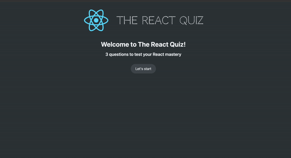

# The React Quiz

_The React Quiz_ is a CRA application containing 15 multiple choice questions on React framework. 

## Getting started 
This app mocks out a call to a fake API hosted on a fake server by the use of an npm package called json-server. To run this project, you will need to run the following commands to start the server and the front end:

- `npm run server`
- `npm start`

## Features

- ### Multiple choice questions.
- ### Count down timer.
- ### Progress bar displaying the current question and the number of points received from answering questions correctly.
- ### The quiz terminates when the timer runs out.
- ### The results are displayed to the user upon finishing the quiz, such as the points they received and the percentage of correct answers.
- ### Ability to restart the quiz.
